# Dashboard

The dashboard page shows general information and about profiles, clients, config files, INSIGHT list...

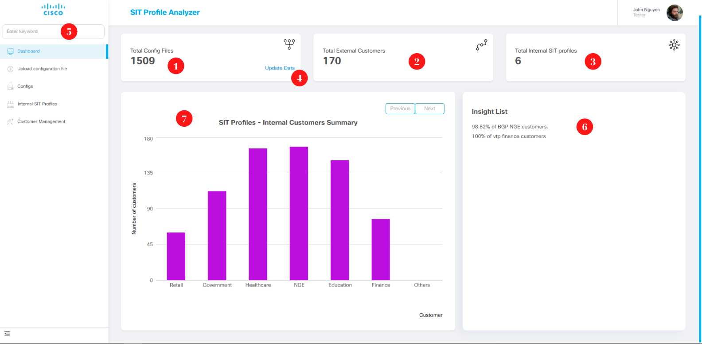

## 1. Total config files

## 2. Total External Customers

## 3. Total Internal SIT profiles

## 4. Update data

When "Update Data" is clicked, all data will be calculated and updated again

## 5. Search Box

When you enter the keyword search, a list of keyword search suggestions will appear. When you press enter, you will be redirected to the search results list page

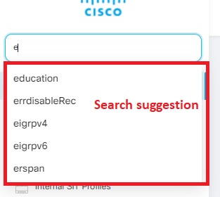

## 7. Insight List

Displays a list of INSIGHT configured on the Server

## 7. Summary Chart

### 7.1. Internal Customers Summary Chart

Default will display the chart "SIT Profiles - Internal Customers Summary"

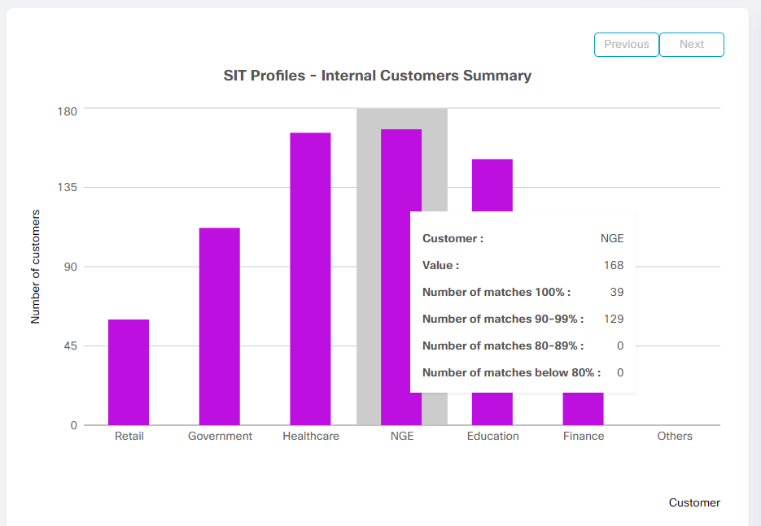

When hovering over a column in the bar chart, the following information will appear:

+ Name of customer
+ Total number of customers
+ Number of matches 100%
+ Number of matches 90-99%
+ Number of matches 80-99%
+ Number of matches below 80%

When clicking on a column in the bar chart, the External Customer Summary chart will appear

### 7.2. External Customer Summary Chart

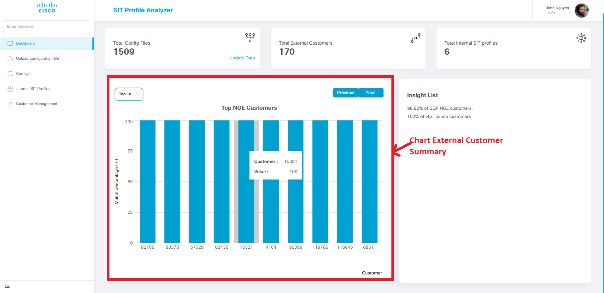

- Can select to show top 10 or show all

- When hovering over a column in the bar chart, show the percentage of that external customer that matches the Internal Customer

- When clicking on a column in the bar chart, the Features Comparison Chart will appear

### 7.3. Features Comparison Summary Chart

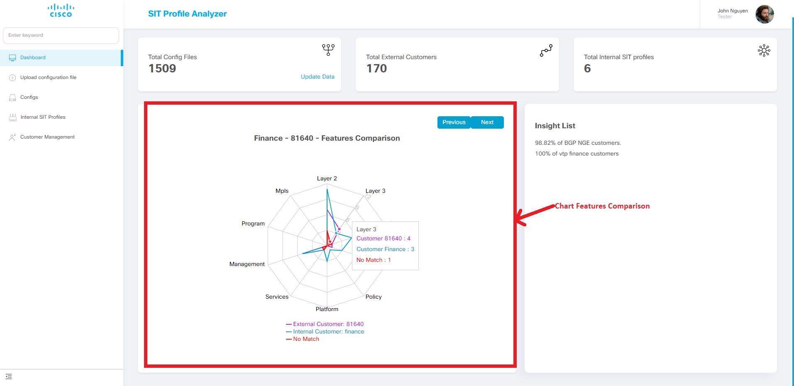

- When hovering over the radar chart, shows the cateogry name, the number of features of the internal customer enabled, the number of features of the external customer enabled, the number of features not matching

- When clicking on the radar char, the Feature Comparison Table will appear

### 7.4. Feature Comparison Table

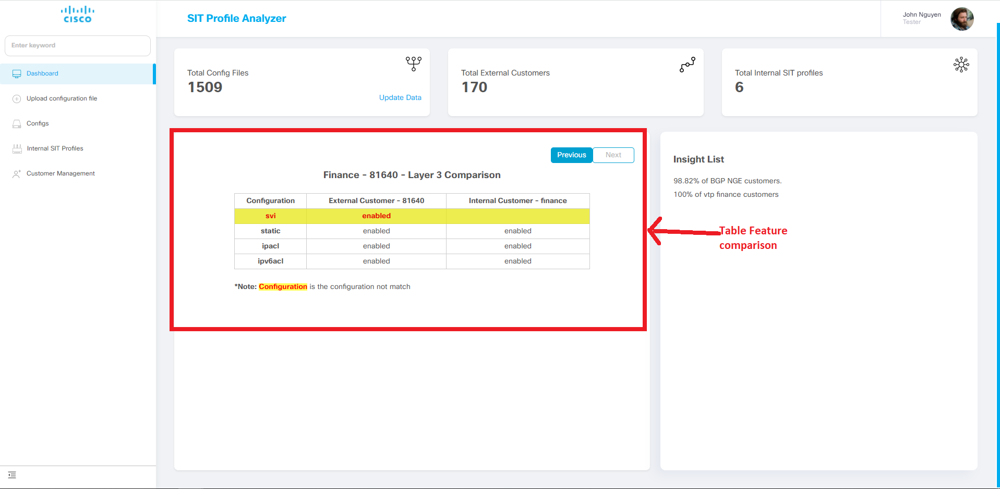
- The config highlighted in red with a yellow background are the profiles that do not match

- When clicking on a row in the table, the Configuration Details Table will appear
  

### 7.5. Configuration Details Table

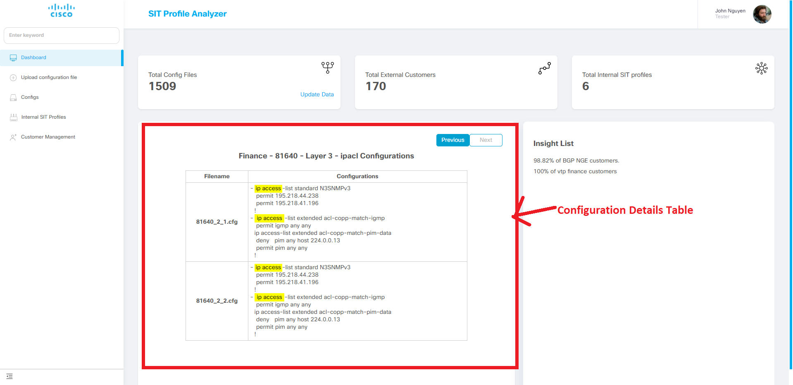
- Config matches are highlighted

# Upload Config

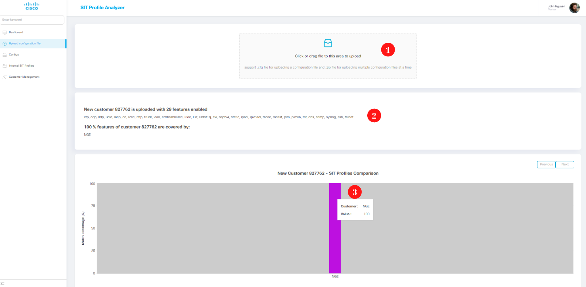

Upload config page allows users to upload a new config file or zip file containing multiple new config files and compare them

## 1. Click or drag and drop files to upload

Can upload a new config file or zip file containing multiple new config files

## 2. Summary info and combination of external customer has just been uploaded

## 3. SIT Profiles Comparison of external customer has just been uploaded

# Search Page 

Help find information about internal customer, external customer, feature,... in the best way.

## A. Search result list

After entering the search keyword in the search box and pressing enter, the list of results will display on the results list page.

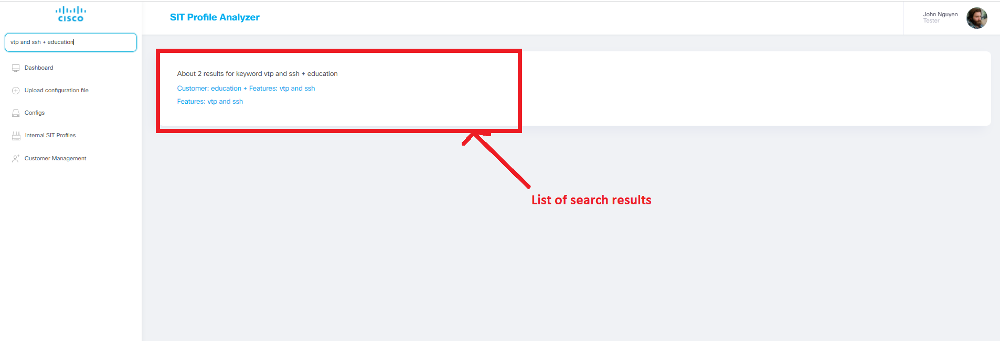

The result is returned as a list of links. When clicking on a link will be redirected to the details of the search results

## B. Search syntax and detailed results:

### 1. Search by internal customer, external customer 

  e.g: 
  > NGE

  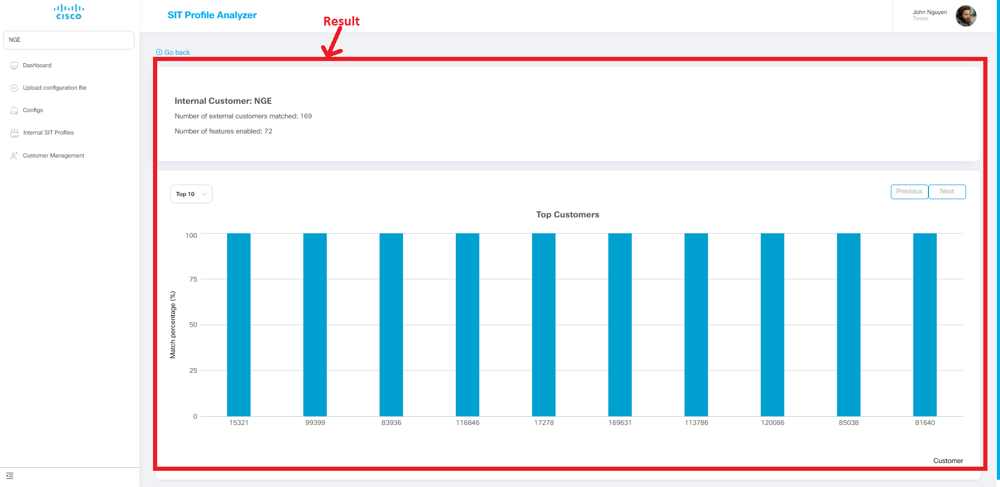

### 2. Search by one single feature or multiple features  

e.g:
  > vtp and ssh

  

### 3. Search by single/multiple features + customer id(both external and internal) 

e.g:
  > vtp and ssh + education

  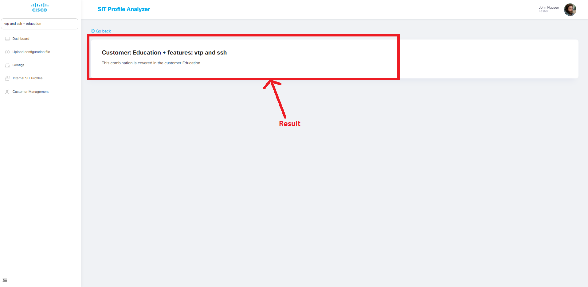

### 4. Search by negating the feature

e.g:
  > !(vtp and ssh)

  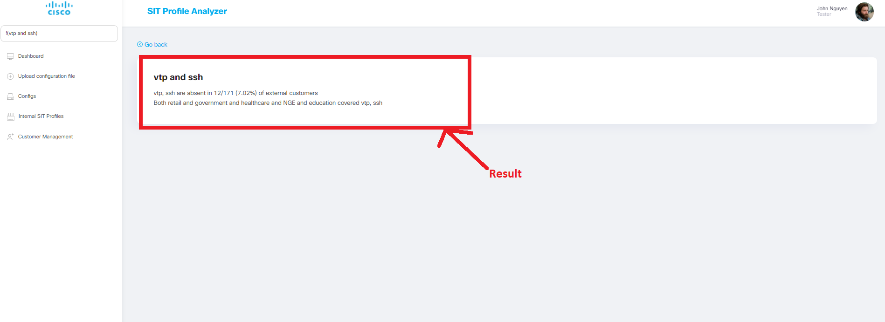

### 5. Search by xor feature

e.g:
  > vtp xor ssh

  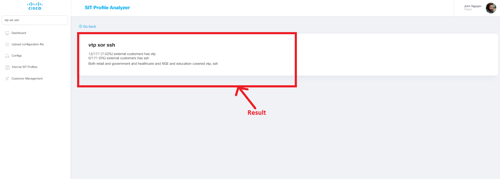

### 6. Scale search

e.g:
  > ipv6_count > 12 and static_route_count > 2

  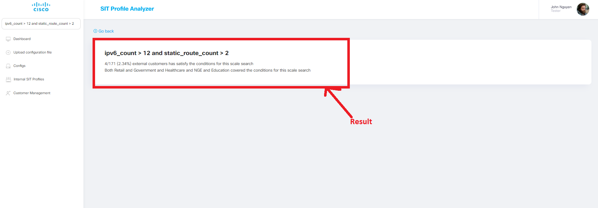

### 7. Search by feature and feature count

e.g:
  > ssh and ipv6_count > 12

  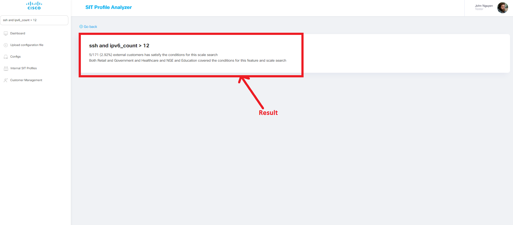
